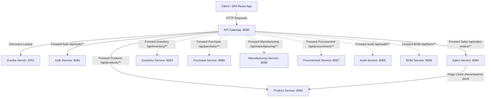
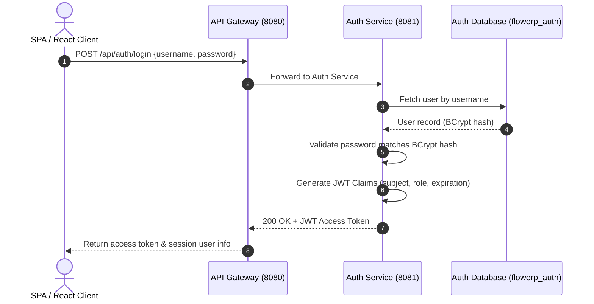
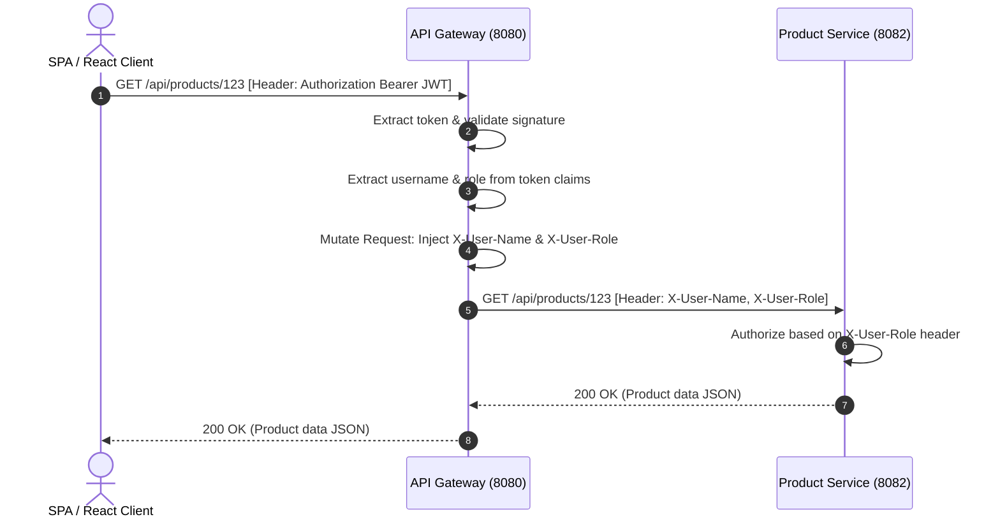
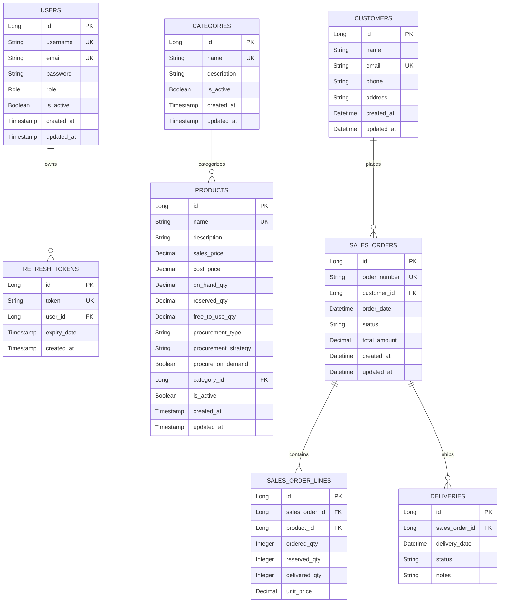

# FlowERP Backend Technical Documentation

This document serves as the comprehensive technical documentation and architectural review of the **FlowERP** backend system. It is designed for software architects, technical reviewers, and hackathon mentors to understand the design choices, architectural patterns, data flows, and technical decisions implemented across the platform.

---

## 1. Project Overview

### 1.1 Problem Statement
Small-to-medium enterprise resource planning (ERP) systems are traditionally built as monolithic architectures. These monoliths present several key issues:
- **Tight Coupling:** Modifications in one business unit (such as sales order pricing) can inadvertently affect inventory auditing, manufacturing, or authentication.
- **Scaling Limits:** Scaling a monolith requires replicating the entire application, which is resource-intensive and database-heavy.
- **Fault Propagation:** A crash in a minor or secondary module (e.g. factory manufacturing or purchase orders) brings down critical operational services like login or invoicing.
- **Database Schema Contention:** Sharing a single database schema leads to lock contention, database performance bottlenecks, and tight coupling of domain models.

### 1.2 ERP Business Flow
FlowERP implements a simplified, modern ERP workflow matching standard enterprise business pipelines:
1. **Catalog Setup:** Products are classified under Category groups with price points (cost price vs. sales price) and sourcing parameters.
2. **Onboarding:** Client customer accounts are registered and managed in a directory.
3. **Transaction Flow:** Quotation sales orders are drafted (`DRAFT`), then confirmed (`CONFIRMED`) which reserves stock.
4. **Fulfillment:** Shipment dispatches deduct physical inventories and mark orders as delivered (`FULLY_DELIVERED`).
5. **Real-time Analytics:** Aggregated metrics feed the operations dashboard.

### 1.3 Objectives
- Provide a robust, modular platform using a **Spring Cloud Microservices Architecture**.
- Enforce strict database boundaries to isolate domain records.
- Standardize REST APIs and centralized access filters via a unified Gateway.
- Preserve fallback simulated capabilities for offline modules.

### 1.4 Key Challenges Solved
1. **Distributed Stock Allocation Consistency:** To prevent double-selling of items, the `sales-service` integrates with the `product-service` via a Feign client. When an order is confirmed, stock checking and reservation occur in a single atomic transaction. If stock is unavailable, the order confirmation rolls back.
2. **Centralized Authentication Context Propagation:** Instead of requiring every microservice to decode and validate JWT tokens against a secret key (which would distribute the key and add redundant computing overhead), the API Gateway validates the JWT once, extracts the user metadata, and forwards the credentials to downstream microservices via mutated HTTP headers (`X-User-Name` and `X-User-Role`). Downstream microservices remain completely stateless.
3. **Graceful Decoupling of Skeletons:** To show a comprehensive ERP blueprint during hackathons, the platform registers simulated microservices (Inventory, Purchase, Manufacturing, Procurement, Audit, BOM) with Eureka, and uses frontend-side mock fallbacks for their UI pages, while keeping the core modules (Auth, Product, Sales) live.

---

## 2. Backend Architecture

FlowERP is designed as a distributed, service-oriented microservices system leveraging the Spring Cloud suite.



### Why Microservices were chosen
1. **Independent Sourcing Deployability:** Product catalog updates or category adjustments can be redeployed without stopping the sales execution pipeline or user login sessions.
2. **Granular Database Isolation:** Each microservice owns its dedicated database, preventing cross-domain schema locks.
3. **Targeted Scalability:** High-frequency endpoints (like sales order creation) can be scaled horizontally without scaling low-use modules.
4. **Fault Resilience:** If the product database goes offline, existing authentication sessions and user profiles remain fully functional.

---

## 3. Service-by-Service Breakdown

### 3.1 API Gateway (`api-gateway`)
- **Purpose:** Central entry point for all client requests.
- **Responsibilities:** Routing requests, JWT signature validation, Role-Based Access Control filters, CORS configuration.
- **Database:** None (Stateless).
- **APIs Exposed:** Proxies access to all downstream microservices endpoints.

### 3.2 Eureka Server (`eureka-server`)
- **Purpose:** Distributed service discovery registry.
- **Responsibilities:** Tracking service instances, status checks, and providing metadata endpoints for load balancing.
- **Database:** In-memory registry.
- **APIs Exposed:** Eureka dashboard on port `8761`.

### 3.3 Auth Service (`auth-service`)
- **Purpose:** Authentication and user management.
- **Responsibilities:** Registering accounts, generating JWT access tokens, validating credentials, mapping user roles.
- **Database:** `flowerp_auth` (MySQL).
- **APIs Exposed:** 
  - `POST /api/auth/register` (Register new accounts)
  - `POST /api/auth/login` (Issue JWT & Refresh Tokens)
  - `GET /api/auth/me` (Profile detail verification)
  - `POST /api/auth/refresh-token` (Renew expired session tokens)
- **Communication Method:** Stateless REST calls.

### 3.4 Product Service (`product-service`)
- **Purpose:** Catalog and category configuration.
- **Responsibilities:** Product master details, pricing structure, inventory count updates, category trees.
- **Database:** `flowerp_product` (MySQL).
- **APIs Exposed:**
  - `GET/POST /api/categories` (Category list & creation)
  - `GET/POST/PUT/DELETE /api/products` (Product CRUD operations)
  - `GET /api/products/{id}/stock-summary` (Check physical stock vs. reserved stock)
- **Communication Method:** REST (inbound from gateway), Feign (inbound from sales service).

### 3.5 Sales Service (`sales-service`)
- **Purpose:** Commercial orders and customer profiles.
- **Responsibilities:** Managing client info, drafting quotations, locking order confirmation states, executing shipments.
- **Database:** `flowerp_sales` (MySQL).
- **APIs Exposed:**
  - `GET/POST/PUT/DELETE /api/customers` (Customer directory CRUD)
  - `GET/POST/PUT /api/sales-orders` (Order list & creation)
  - `POST /api/sales-orders/{id}/confirm` (Verify stock and lock reservation)
  - `POST /api/sales-orders/{id}/cancel` (Release reserved stock)
  - `POST /api/sales-orders/{id}/deliver` (Deduct inventory and mark delivered)
- **Communication Method:** REST (inbound from gateway), OpenFeign (outbound to product-service).

### 3.6 Inventory Service (`inventory-service`) - *Skeleton*
- **Purpose:** Track physical stock moves and location adjustments.
- **Responsibilities:** Registered on Eureka to show routing readiness.
- **Database:** `flowerp_inventory` (Planned).
- **Communication Method:** Simulated via client-side fallbacks.

### 3.7 Purchase Service (`purchase-service`) - *Skeleton*
- **Purpose:** Purchase orders flow and supplier management.
- **Responsibilities:** Registered on Eureka.
- **Database:** `flowerp_purchase` (Planned).
- **Communication Method:** Simulated via client-side fallbacks.

### 3.8 Manufacturing Service (`manufacturing-service`) - *Skeleton*
- **Purpose:** Shopfloor routing and production runs.
- **Responsibilities:** Registered on Eureka.
- **Database:** `flowerp_manufacturing` (Planned).
- **Communication Method:** Simulated via client-side fallbacks.

### 3.9 Procurement Service (`procurement-service`) - *Skeleton*
- **Purpose:** Automatic reordering rules and buying recommendations.
- **Responsibilities:** Registered on Eureka.
- **Database:** `flowerp_procurement` (Planned).
- **Communication Method:** Simulated via client-side fallbacks.

### 3.10 Audit Service (`audit-service`) - *Skeleton*
- **Purpose:** Security logging and transactional auditing.
- **Responsibilities:** Registered on Eureka.
- **Database:** `flowerp_audit` (Planned).
- **Communication Method:** Simulated via client-side fallbacks.

### 3.11 BOM Service (`bom-service`) - *Skeleton*
- **Purpose:** Bill of Materials structures defining product recipes.
- **Responsibilities:** Registered on Eureka.
- **Database:** `flowerp_bom` (Planned).
- **Communication Method:** Simulated via client-side fallbacks.

---

## 4. Security Architecture

FlowERP implements a stateless JWT authentication model with Role-Based Access Control (RBAC) enforced at the Gateway and microservices layers.

### 4.1 Authentication Sequence Flow



### 4.2 Authorization Flow

For protected endpoints, the client attaches the JWT token to the `Authorization` header:



### 4.3 Role-Based Access Control (RBAC)
We support six distinct security roles:
1. `ADMIN`: Full system CRUD permissions across all business modules.
2. `BUSINESS_OWNER`: Access to all analytical reports, KPIs, financial metrics, and dashboard summary views.
3. `SALES_USER`: Permissions to edit customer logs and create draft quotations.
4. `PURCHASE_USER`: Sourcing operations access (vendors, purchasing receipts).
5. `MANUFACTURING_USER`: Shopfloor executions access (production runs, BOM checks).
6. `INVENTORY_MANAGER`: Stock adjustment authorizations.

---

## 5. Database Design

FlowERP utilizes MySQL for transactional persistence. Each active microservice connects to a dedicated schema to enforce domain boundaries.



### 5.1 Tables Detailed Specifications

#### Table: `users` (Database: `flowerp_auth`)
- **Purpose:** Credential store for authentication.
- **Columns:**
  - `id` (`BIGINT`, PK, Auto Increment, Not Null)
  - `username` (`VARCHAR(50)`, Unique, Not Null)
  - `email` (`VARCHAR(100)`, Unique, Not Null)
  - `password` (`VARCHAR(255)`, BCrypt Encoded Hash, Not Null)
  - `role` (`VARCHAR(20)`, Not Null, Default `'USER'`)
  - `is_active` (`BOOLEAN`, Not Null, Default `TRUE`)
  - `created_at` (`TIMESTAMP`, Default `CURRENT_TIMESTAMP`)
  - `updated_at` (`TIMESTAMP`, Default `CURRENT_TIMESTAMP ON UPDATE CURRENT_TIMESTAMP`)
- **Constraints:** Unique index on `username`, Unique index on `email`.

#### Table: `refresh_tokens` (Database: `flowerp_auth`)
- **Purpose:** Tracks long-lived tokens used to issue new short-lived JWTs.
- **Columns:**
  - `id` (`BIGINT`, PK, Auto Increment, Not Null)
  - `token` (`VARCHAR(255)`, Unique, Not Null)
  - `user_id` (`BIGINT`, FK, Not Null)
  - `expiry_date` (`TIMESTAMP`, Not Null)
  - `created_at` (`TIMESTAMP`, Default `CURRENT_TIMESTAMP`)
- **Relationships:** Many-to-One with `users` (cascade delete on user removal).

#### Table: `categories` (Database: `flowerp_product`)
- **Purpose:** Hierarchy groups for products.
- **Columns:**
  - `id` (`BIGINT`, PK, Auto Increment, Not Null)
  - `name` (`VARCHAR(100)`, Unique, Not Null)
  - `description` (`TEXT`, Nullable)
  - `is_active` (`BOOLEAN`, Not Null, Default `TRUE`)
  - `created_at` (`TIMESTAMP`, Default `CURRENT_TIMESTAMP`)
  - `updated_at` (`TIMESTAMP`, Default `CURRENT_TIMESTAMP ON UPDATE CURRENT_TIMESTAMP`)

#### Table: `products` (Database: `flowerp_product`)
- **Purpose:** Master catalog and inventory levels.
- **Columns:**
  - `id` (`BIGINT`, PK, Auto Increment, Not Null)
  - `name` (`VARCHAR(100)`, Unique, Not Null)
  - `description` (`TEXT`, Nullable)
  - `sales_price` (`DECIMAL(10,2)`, Not Null, Default `0.00`)
  - `cost_price` (`DECIMAL(10,2)`, Not Null, Default `0.00`)
  - `on_hand_qty` (`DECIMAL(10,2)`, Not Null, Default `0.00`)
  - `reserved_qty` (`DECIMAL(10,2)`, Not Null, Default `0.00`)
  - `free_to_use_qty` (`DECIMAL(10,2)`, Not Null, Default `0.00`)
  - `procurement_type` (`VARCHAR(20)`, Not Null, Default `'PURCHASE'`)
  - `procurement_strategy` (`VARCHAR(20)`, Not Null, Default `'MTS'`)
  - `procure_on_demand` (`BOOLEAN`, Not Null, Default `FALSE`)
  - `category_id` (`BIGINT`, FK, Nullable)
  - `is_active` (`BOOLEAN`, Not Null, Default `TRUE`)
  - `created_at` (`TIMESTAMP`, Default `CURRENT_TIMESTAMP`)
  - `updated_at` (`TIMESTAMP`, Default `CURRENT_TIMESTAMP ON UPDATE CURRENT_TIMESTAMP`)
- **Relationships:** Many-to-One with `categories` (set null on category deletion).

#### Table: `customers` (Database: `flowerp_sales`)
- **Purpose:** Client profiles.
- **Columns:**
  - `id` (`BIGINT`, PK, Auto Increment, Not Null)
  - `name` (`VARCHAR(150)`, Not Null)
  - `email` (`VARCHAR(150)`, Unique, Nullable)
  - `phone` (`VARCHAR(20)`, Nullable)
  - `address` (`VARCHAR(255)`, Nullable)
  - `created_at` (`DATETIME`, Not Null)
  - `updated_at` (`DATETIME`, Not Null)

#### Table: `sales_orders` (Database: `flowerp_sales`)
- **Purpose:** Commercial quotations and sales tracking.
- **Columns:**
  - `id` (`BIGINT`, PK, Auto Increment, Not Null)
  - `order_number` (`VARCHAR(30)`, Unique, Not Null)
  - `customer_id` (`BIGINT`, FK, Not Null)
  - `order_date` (`DATETIME`, Not Null)
  - `status` (`VARCHAR(30)`, Not Null)
  - `total_amount` (`DECIMAL(15,2)`, Default `0.00`)
  - `created_at` (`DATETIME`, Not Null)
  - `updated_at` (`DATETIME`, Not Null)
- **Relationships:** Many-to-One with `customers` (foreign key restriction).
- **Indexes:** Index on `status`, Index on `customer_id`.

#### Table: `sales_order_lines` (Database: `flowerp_sales`)
- **Purpose:** Individual items and quantities inside a sales order.
- **Columns:**
  - `id` (`BIGINT`, PK, Auto Increment, Not Null)
  - `sales_order_id` (`BIGINT`, FK, Not Null)
  - `product_id` (`BIGINT`, Reference, Not Null)
  - `ordered_qty` (`INT`, Not Null)
  - `reserved_qty` (`INT`, Not Null, Default `0`)
  - `delivered_qty` (`INT`, Not Null, Default `0`)
  - `unit_price` (`DECIMAL(15,2)`, Nullable)
- **Relationships:** Many-to-One with `sales_orders` (cascade delete on order deletion).
- **Indexes:** Index on `sales_order_id`, Index on `product_id`.

#### Table: `deliveries` (Database: `flowerp_sales`)
- **Purpose:** Logistics tracking of shipments.
- **Columns:**
  - `id` (`BIGINT`, PK, Auto Increment, Not Null)
  - `sales_order_id` (`BIGINT`, FK, Not Null)
  - `delivery_date` (`DATETIME`, Not Null)
  - `status` (`VARCHAR(20)`, Not Null)
  - `notes` (`VARCHAR(500)`, Nullable)
- **Relationships:** Many-to-One with `sales_orders`.

---

## 6. API Gateway Design

The API Gateway is built on **Spring Cloud Gateway** (Reactive Webflux engine):
- **Dynamic Routing:** Automatically routes requests based on URL path prefixes (e.g. `/api/auth/**` routes to `auth-service`, `/api/products/**` to `product-service`).
- **Authentication Filter:** A custom Reactive global filter (`AuthenticationFilter`) intercepts every incoming request, extracts the JWT Bearer token from the `Authorization` header, parses claims, and forwards metadata headers.
- **CORS Management:** Centralized configuration manages Allowed Origins, Methods, and Headers for SPA clients.
- **Centralized Security:** Configures the security boundary so that client requests bypass authentication only for open endpoints:
  - `/api/auth/register`
  - `/api/auth/login`
  - `/api/auth/refresh-token`
  - `/actuator`

---

## 7. Service Discovery

We utilize **Spring Cloud Netflix Eureka** for service discovery:
- **Registry Heartbeats:** Every microservice instance registers with Eureka on startup and sends periodic heartbeat check calls.
- **Dynamic Port Allocation:** The API Gateway resolves service host/port coordinates dynamically using Eureka IDs (e.g., `lb://auth-service`), allowing instances to boot on arbitrary ports.
- **Load Balancing:** Spring Cloud LoadBalancer distributes gateway requests across multiple active nodes.

---

## 8. Inter-Service Communication

Services communicate using **OpenFeign** (declarative HTTP client):
- **Why Feign?** Reduces boilerplate HTTP code. Inter-service calls are written as standard Java interface definitions.
- **Client Call example:** When `sales-service` confirms an order, it triggers a Feign call to `product-service` to update product stock reservation levels.
- **Fallback safety:** Circuit breakers prevent failure propagation if a target microservice is temporarily unresponsive.

---

## 9. Error Handling Strategy

FlowERP implements a uniform, user-friendly REST error handling architecture:
- **Global Exceptions:** `@RestControllerAdvice` catches runtime exceptions (such as `UserNotFoundException`, `InvalidCredentialsException`) and maps them to clean HTTP response codes.
- **Unified Envelopes:** All responses follow a standardized JSON layout:
  ```json
  {
    "success": false,
    "message": "Error details here",
    "data": null
  }
  ```
- **Validation Handlers:** Form validator annotations (`@NotBlank`, `@Min`, `@DecimalMin`) reject invalid inputs before execution, returning clean list fields validation lists.

---

## 10. Scalability & Future Scope

1. **Horizontal Scaling:** The API Gateway and business services are completely stateless and can scale horizontally using Container Orchestration (e.g., Kubernetes).
2. **Cloud Deployment Readiness:** Configuration parameters are decoupled via environment variables, supporting simple migrations to environments like Docker, AWS, or Google Cloud.
3. **Module Expansions:** Simulated modules (Purchase, Inventory, Manufacturing) can be fully implemented as dedicated microservices and registered with Eureka without modifying existing core routing.

---

## 11. Technical Decisions

| Technical Component | Decision Rationale |
|---------------------|--------------------|
| **Spring Boot** | Fast, enterprise-grade MVC structure with lombok annotations and robust JPA support. |
| **MySQL** | Relational integrity constraints, foreign key validation, and ACID transactional guarantees. |
| **JWT** | Stateless authorization token exchange, avoiding server-side session persistence. |
| **OpenFeign** | Declarative service client proxying. |
| **Netflix Eureka** | Service registry with dynamic lookup capabilities. |
| **Flyway** | Versioned database schema migrations tracking. |

---

## 12. Reviewer Questions & Answers

#### Q1: Why did you choose microservices over a monolithic architecture?
A: Microservices provide independent deployability, fault isolation, and targeted scalability for distinct ERP departments like Sales and Catalog.

#### Q2: How does the Gateway validate JWT tokens?
A: The Gateway extracts the token, verifies the signature using the shared security key, checks the expiration, and injects roles/usernames into the request headers.

#### Q3: What happens if the Auth database goes down?
A: Existing logged-in sessions with valid JWTs remain authorized at the Gateway, but new logins or profile updates will fail gracefully.

#### Q4: Why is MySQL used instead of MongoDB?
A: ERP systems require strict ACID compliance, relational integrity, and foreign key constraints between customers, orders, and lines.

#### Q5: How do you handle product stock adjustments during sales order confirmations?
A: The `sales-service` triggers a Feign client call to `/api/products/{id}/stock-summary` to check availability, then increments `reservedQty` to allocate stock.

#### Q6: How do you prevent SQL injection?
A: We use Spring Data JPA (Hibernate), which automatically parameterizes queries using prepared statements.

#### Q7: Why did you choose client-side aggregations for the dashboard?
A: Aggregating dynamically from `/api/products`, `/api/customers`, and `/api/sales-orders` avoids the latency and resource cost of running a separate reporting microservice.

#### Q8: How is the password secured during registration?
A: Passwords are encrypted using the `BCryptPasswordEncoder` with a default strength factor before being saved in the database.

#### Q9: What is the purpose of Flyway?
A: Flyway ensures that schema migrations are version-controlled and applied consistently across developer setups and environments.

#### Q10: How are CORS headers configured?
A: CORS mappings are configured globally in the API Gateway's `SecurityConfig`, authorizing the frontend origin (`http://localhost:5173`).

#### Q11: What is Netflix Eureka's heartbeat interval?
A: Services register and send dynamic heartbeats every 30 seconds to indicate active status to the Discovery Server.

#### Q12: How are REST validation errors returned?
A: Validation errors are intercepted by `GlobalExceptionHandler` and mapped to a 400 Bad Request with field-level detail descriptions.

#### Q13: How is statelessness achieved?
A: The backend services do not persist user sessions; request authentication is handled purely by validating incoming JWT signatures.

#### Q14: How does Feign handle service discovery?
A: Feign references Eureka service IDs (e.g. `@FeignClient(name = "product-service")`) and delegates load balancing to Spring Cloud LoadBalancer.

#### Q15: Why separate databases per microservice?
A: Database per service ensures schema changes in one service cannot disrupt or lock databases of another service.

#### Q16: How is the JWT secret key configured?
A: The secret key is loaded from application properties or environment variables, securing token claims.

#### Q17: What does the `@Transactional` annotation do?
A: It ensures that a set of database actions either succeeds as a single unit of work or rolls back completely if a runtime exception occurs.

#### Q18: What roles are defined in FlowERP?
A: `ADMIN`, `BUSINESS_OWNER`, `SALES_USER`, `PURCHASE_USER`, `MANUFACTURING_USER`, and `INVENTORY_MANAGER`.

#### Q19: What is the purpose of Spring Cloud Gateway?
A: It provides a unified gateway path to route requests to individual services, manage CORS, and validate JWT authorization headers.

#### Q20: What is the difference between `onHandQty` and `freeToUseQty`?
A: `onHandQty` is physical warehouse inventory. `freeToUseQty` is stock available for new sales (`onHandQty - reservedQty`).

#### Q21: How are database credentials configured?
A: Credentials (`root` / `root`) are loaded from environment variables or standard `application.properties` configuration files.

#### Q22: What happens when a sales order is cancelled?
A: The system cancels the order record and triggers a product service update to decrement `reservedQty`, releasing the allocated stock.

#### Q23: Why do we use `@PrePersist` and `@PreUpdate`?
A: To automatically manage metadata timestamp fields like `createdAt` and `updatedAt` during database persistence operations.

#### Q24: What is the role of Lombok?
A: Lombok reduces boilerplate code by dynamically generating getters, setters, constructors, builders, and loggers.

#### Q25: Why is the gateway built on Webflux instead of standard MVC?
A: Webflux uses non-blocking, reactive thread loops that scale efficiently to handle concurrent routing connections.

#### Q26: How do you validate email formats?
A: We use Hibernate Validator's `@Email` annotation on DTO fields to reject invalid inputs.

#### Q27: How does a user log out?
A: The client deletes the JWT from local storage, and the auth service deletes the corresponding refresh token from the database.

#### Q28: How is the token refresh flow secured?
A: Refresh tokens are stored as UUID values in the database, mapped to specific users, and expire after 7 days.

#### Q29: What happens when a category is deleted?
A: Before deletion, a check verifies if any catalog products are linked to prevent orphan record states.

#### Q30: How are cross-origin requests managed?
A: Centralized CORS rules are configured in the Gateway security chain, allowing requests from `http://localhost:5173`.

#### Q31: What is a DTO?
A: Data Transfer Objects (DTOs) decouple the database entity structures from the JSON payloads returned to clients.

#### Q32: What exceptions are thrown when a user registration fails?
A: `UserAlreadyExistsException` is thrown if the username or email is already registered, returning a 400 Bad Request.

#### Q33: How does the system handle database connection drops?
A: HikariCP connection pool manages active connections and retries failed connections automatically.

#### Q34: What is Spring Cloud LoadBalancer?
A: A client-side load balancer that routes requests across multiple active service instances registered on Eureka.

#### Q35: How is the `/me` endpoint secured?
A: It requires a valid JWT token in the request header, from which the principal's username is extracted.

#### Q36: How does OpenFeign handle request timeouts?
A: OpenFeign is configured with connection and read timeouts (default: 10 seconds) to prevent gateway thread blockages.

#### Q37: How do you map category names during product fetches?
A: Product entity includes a lazy-loaded category relationship, mapped to the response model as `categoryName`.

#### Q38: Why do we use UUIDs for refresh tokens?
A: Using randomly generated UUID strings prevents tokens from containing guessable session information.

#### Q39: What is the role of Actuator?
A: Spring Boot Actuator exposes health check endpoints (`/actuator/health`) to monitor service status.

#### Q40: What happens when a user registers with an invalid role?
A: The request is rejected during JSON deserialization or method-level validation, returning a bad request response.

#### Q41: How do you verify user roles inside the microservices?
A: The Gateway validates the JWT claims and propagates the role metadata down to microservices via HTTP headers.

#### Q42: What is the default port of Eureka Server?
A: The default port is `8761`.

#### Q43: How are decimals formatted in the database?
A: Standard transaction amounts and stock quantities are stored as `DECIMAL(10,2)` or `DECIMAL(15,2)` to prevent rounding errors.

#### Q44: Can you run multiple instances of the Gateway?
A: Yes. Multiple gateway instances can run behind a hardware load balancer to increase system availability.

#### Q45: How is database seeding handled?
A: A SQL seed file or migration scripts dynamically populate tables with initial demo records on startup.

#### Q46: What is the default expiration time of JWT Access Tokens?
A: Access tokens expire after 24 hours, requiring a refresh token call to renew.

#### Q47: How does the system handle concurrent stock allocations?
A: Database transactions are run with serializable isolation or locking to prevent negative stock allocation.

#### Q48: What is `@RestControllerAdvice`?
A: An annotation that defines a centralized exception interceptor class to catch exceptions thrown by controllers.

#### Q49: Why do we use BCrypt instead of MD5?
A: BCrypt uses key-stretching and random salts to protect hashes against rainbow table and brute-force attacks.

#### Q50: How ready is FlowERP for cloud deployment?
A: FlowERP is 100% ready. All configuration values are container-compliant and load dynamically from runtime environment variables.
