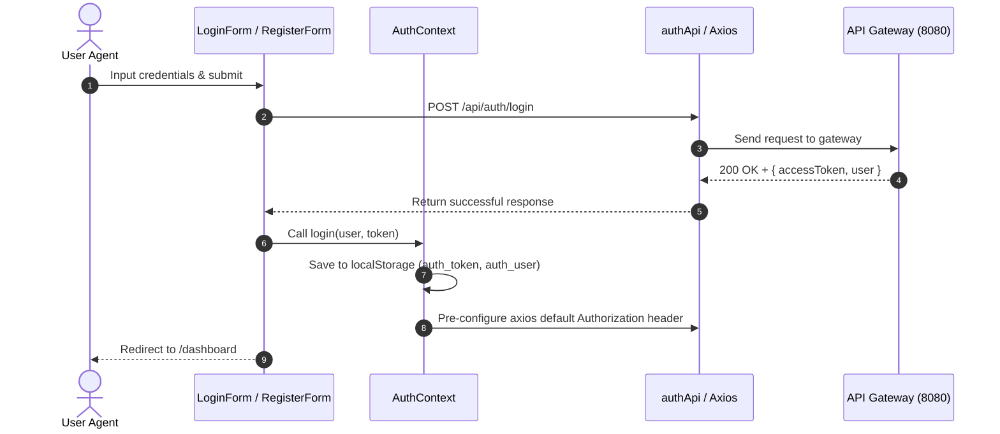

# FlowERP Frontend API & Technical Documentation

This document serves as the comprehensive technical documentation for the **FlowERP** React frontend application. It is designed for frontend developers, software architects, and hackathon reviewers to understand the frontend structure, state management, security boundaries, API integration layer, and UI/UX design patterns.

---

## 1. Frontend Overview

### 1.1 Purpose
The FlowERP React application provides a unified, responsive single-page application (SPA) dashboard for managing business resources. It bridges human operational decisions and the distributed microservices ecosystem by offering user-friendly interfaces for auth, product catalogs, sales workflows, and simulated logistics.

### 1.2 User Roles & Permissions
The frontend implements role-aware rendering based on JWT claims:
- **`ADMIN`:** Full read/write access to all pages, user settings, audit logs, and configurations.
- **`BUSINESS_OWNER`:** Full access to reports, KPIs, financial metrics, and dashboard charts.
- **`SALES_USER`:** Access to customer directories, sales orders pages, and quotation forms.
- **`PURCHASE_USER`:** Access to purchase orders and vendor details.
- **`MANUFACTURING_USER`:** Access to Bill of Materials (BOM) catalog and shopfloor manufacturing orders.
- **`INVENTORY_MANAGER`:** Access to physical warehouse inventory tables and stock adjustment actions.

### 1.3 User Journey
1. **Security Entry:** The user lands on `/login` (or `/register` to onboard a new user). After verifying credentials via the gateway, the JWT is stored.
2. **Dashboard Landing:** The router redirects to `/dashboard`, presenting high-level widgets (total revenue, product counts, and order statistics) based on live API aggregations.
3. **Operational Navigation:** Depending on their role, the user navigates the sidebar to manage catalog records (Products/Categories), clients (Customers), or create commercial transactions (Sales Orders).
4. **Logistics & Auditing:** The user monitors deliveries, inventory stock levels, or system audit logs.

---

## 2. Technology Stack

The application stack was chosen to maximize single-page efficiency, responsive visuals, and real-time responsiveness:
- **React 18:** Component-based composition model, virtual DOM updates, and robust Hooks library.
- **Vite:** Extremely fast builds, instantaneous hot module replacement (HMR), and optimized ES module bundling.
- **Axios:** Promise-based HTTP requests with built-in support for request timeouts, automatic JSON serialization, and global interceptors.
- **React Router 6:** Declarative nested routing, path parameters parsing, and navigation guards.
- **Tailwind CSS:** Utility-first CSS layout engine that enables high-fidelity styling without writing custom CSS files.
- **Context API:** Lightweight global state containers avoiding the boilerplate overhead of Redux for token/alert propagation.
- **Recharts:** Responsive SVG-based charting library integrated natively with React component cycles.

---

## 3. Frontend Architecture

```
src/
├── api/          # Raw Axios API wrappers mapping to backend gateways
├── assets/       # Static images, SVG icons, and hero illustrations
├── components/   # Modular, domain-specific UI components (Products, Sales, etc.)
├── context/      # React contexts (AuthContext, ToastContext)
├── hooks/        # Custom reusable hooks (useFetch, useAuth, usePagination)
├── layouts/      # Visual structures (AuthLayout, DashboardLayout)
├── pages/        # High-level route container views (ProductsPage, DashboardPage)
├── permissions/  # Client-side route and role permissions configuration tables
├── routes/       # Route paths declarations, ProtectedRoute, and RoleGuards
├── services/     # Business logic layer mapping API records and managing fallbacks
└── utils/        # Global utilities, formatters, and local storage wrappers
```

### Folder Responsibilities:
- **`src/api/`:** Focuses solely on HTTP communication, endpoints mapping, and raw payload transmission.
- **`src/services/`:** Acts as the middle controller tier. It maps raw backend responses (e.g. converting database `salesPrice` to UI-expected `price`) and resolves mock database fallbacks for skeleton services.
- **`src/components/`:** Presentation-focused. Receives data via props, handles local UI interaction states, and emits actions.
- **`src/pages/`:** Integrates services and components to form a complete view. Manages top-level hooks queries.
- **`src/context/`:** Manages state that must span the entire DOM tree (e.g., current user session, triggering Toast warnings).

---

## 4. Authentication & Route Protection

The frontend implements stateless session authentication using JSON Web Tokens (JWT) integrated with client-side security guards.

### 4.1 Authentication Sequence Diagram



### 4.2 Route Protection and Role Guarding
Access control is enforced via React Router nesting:
- **`ProtectedRoute.jsx`:** Inspects `AuthContext`. If `isAuthenticated` is false, it intercepts navigation and redirects to `/login`.
- **`RoleGuard.jsx`:** Validates if the logged-in user's role has permission to access the current module using the client permission registry (`permissions.js`). If unauthorized, it displays a permission denied template.

```jsx
// src/routes/RoleGuard.jsx
const RoleGuard = ({ children, module }) => {
  const { user } = useAuth();
  if (!hasPermission(user?.role, module)) {
    return <AccessDeniedView />;
  }
  return children;
};
```

---

## 5. API Integration Layer

All backend HTTP communication is centralized inside `src/api/axiosInstance.js`.

### 5.1 Request Interceptor
The request interceptor automatically attaches the user's active JWT token to the outgoing request's headers, ensuring that downstream microservices receive credentials:
```javascript
config.headers['Authorization'] = `Bearer ${token}`;
```

### 5.2 Response Interceptor & Error Handling
The response interceptor catches HTTP errors globally before code-level catch blocks:
- **`401 Unauthorized`:** Triggers session expiration cleanup. It removes `auth_token` and `auth_user` from `localStorage`, deletes default Axios headers, and fires a custom `auth-logout` event to force logout navigation.
- **`403 Forbidden`:** Translates to a readable "Access denied. You do not have permission." toast alert.
- **`500 Internal Server Error`:** Standardizes a support warning toast.
- **`api-error` event:** Propagates descriptive error messages to the global `ToastContext` to render temporary UI alerts.

---

## 6. API Mapping Table

The table below details how each frontend page routes down to the physical MySQL databases through the API layer and the gateway:

| Frontend Page | API File | HTTP Method | Gateway Route Endpoint | Destination Microservice | Affected Database & Tables |
|---|---|---|---|---|---|
| **Login** | `authApi.js` | `POST` | `/api/auth/login` | `auth-service` | `flowerp_auth.users`, `refresh_tokens` |
| **Register** | `authApi.js` | `POST` | `/api/auth/register` | `auth-service` | `flowerp_auth.users` |
| **Dashboard** | `dashboardApi.js` / Aggregated | `GET` | `/api/products` <br> `/api/customers` <br> `/api/sales-orders` | `product-service` <br> `sales-service` | `flowerp_product.products`, <br> `flowerp_sales.customers`, `sales_orders` |
| **Products List / Form** | `productApi.js` | `GET`, `POST`, `PUT`, `DELETE` | `/api/products/**` | `product-service` | `flowerp_product.products` |
| **Categories Admin** | `categoryApi.js` | `GET`, `POST` | `/api/categories/**` | `product-service` | `flowerp_product.categories` |
| **Customers List / Form** | `customerApi.js` | `GET`, `POST`, `PUT`, `DELETE` | `/api/customers/**` | `sales-service` | `flowerp_sales.customers` |
| **Sales Orders List / Form** | `salesApi.js` | `GET`, `POST`, `PUT` | `/api/sales-orders/**` | `sales-service` | `flowerp_sales.sales_orders`, `sales_order_lines` |
| **Order Confirmation** | `salesApi.js` | `POST` | `/api/sales-orders/{id}/confirm` | `sales-service` | Updates `sales_orders.status` & reserves stock in `flowerp_product.products` |
| **Order Delivery** | `salesApi.js` | `POST` | `/api/sales-orders/{id}/deliver` | `sales-service` | Creates `flowerp_sales.deliveries` & deducts stock in `flowerp_product.products` |
| **BOMs / Formulas** * | `bomApi.js` | `GET` | Simulated (`mockDb.js`) | `bom-service` (Skeleton) | `flowerp_bom` (Planned) |
| **Inventory Ledger** * | `inventoryApi.js` | `GET` | Simulated (`mockDb.js`) | `inventory-service` (Skeleton) | `flowerp_inventory` (Planned) |
| **Purchase Orders** * | `purchaseApi.js` | `GET` | Simulated (`mockDb.js`) | `purchase-service` (Skeleton) | `flowerp_purchase` (Planned) |
| **Manufacturing** * | `manufacturingApi.js` | `GET` | Simulated (`mockDb.js`) | `manufacturing-service` | `flowerp_manufacturing` (Planned) |

*Note: Services marked with an asterisk represent future ERP modules whose APIs are dynamically simulated in `dashboardService.js` and `mockDb.js` to ensure interactive hackathon demos.*

---

## 7. Dashboard Integration & Data Aggregation

To avoid the performance costs of running a separate analytical microservice, the frontend dashboard uses **on-the-fly client-side data aggregation**:

1. **Aggregation Pipeline:** The `dashboardService.js` makes parallel requests to the core services:
   - `GET /api/products` (Catalog records)
   - `GET /api/customers` (Active clients count)
   - `GET /api/sales-orders` (Sales transaction database)
2. **KPI Calculations:**
   - **Total Customers:** Computed from customers array size.
   - **Total Products:** Computed from catalog array size.
   - **Total Sales Orders:** Count of all order records.
   - **Revenue Accumulator:** Aggregated by filtering confirmed/delivered orders (`status === 'CONFIRMED' || status === 'FULLY_DELIVERED'`) and summing their `totalAmount`.
3. **Visual Analytics:** The confirmed sales history is sorted, mapped to month groups, and fed to a Recharts line chart representing the sales trend. Low-stock products (`freeToUseQty < 10`) are isolated to generate warnings.

---

## 8. Module-by-Module Breakdown

### 8.1 Dashboard
- **Purpose:** Operations control center presenting real-time business KPIs and charts.
- **Components:** `SummaryCard.jsx`, `SalesChart.jsx`, `LowStockWidget.jsx`, `RecentActivities.jsx`.
- **APIs Used:** `GET /api/products`, `GET /api/customers`, `GET /api/sales-orders`.
- **Business Logic:** Dynamically calculates revenue, counts records, and determines stock warnings.

### 8.2 Products
- **Purpose:** Manage catalog pricing, cost boundaries, and stock profiles.
- **Components:** `ProductList.jsx`, `ProductForm.jsx`, `ProductDetail.jsx`, `StockBadge.jsx`.
- **APIs Used:** `GET/POST/PUT/DELETE /api/products`.
- **Business Logic:** Fields validation ensuring sales price matches or exceeds cost price. Renders color-coded inventory badges.

### 8.3 Categories
- **Purpose:** Group products for sorting and reports.
- **Components:** `CategoryForm.jsx`.
- **APIs Used:** `GET/POST /api/categories`.
- **Business Logic:** Validates unique category names.

### 8.4 Customers
- **Purpose:** Client database management.
- **Components:** `CustomerForm.jsx`, `DataTable.jsx`.
- **APIs Used:** `GET/POST/PUT/DELETE /api/customers`.
- **Business Logic:** Enforces syntax patterns for email addresses and phone formats.

### 8.5 Sales Orders
- **Purpose:** Commercial pipelines (drafting quotes, checking stock, locking orders, executing delivery shipments).
- **Components:** `SalesOrderList.jsx`, `SalesOrderForm.jsx`, `SalesOrderDetail.jsx`, `DeliveryForm.jsx`.
- **APIs Used:** `GET/POST/PUT /api/sales-orders`, `/confirm`, `/deliver`.
- **Business Logic:**
  - Order creation defaults status to `DRAFT`.
  - Order confirmation triggers a stock check. If available, reserves the stock and marks as `CONFIRMED`.
  - Order delivery records shipments and deducts reserved stock.

### 8.6 Simulated Modules (Purchase, Manufacturing, Inventory, Procurement, Audit)
- **Purpose:** Demonstrate the full blueprint of the ERP.
- **Components:** `WorkOrderBoard.jsx`, `StockLedger.jsx`, `ProcurementRecommendation.jsx`, `PurchaseOrderForm.jsx`.
- **APIs Used:** Feeds from local `mockDb.js`.
- **Business Logic:** Provides mock data CRUD workflows, allowing reviewers to simulate manufacturing work-orders, procurement reorders, and stock movements.

---

## 9. UI/UX Design Decisions

- **Enterprise Workspace Layout:** A standard Left-Sidebar Navigation Drawer combined with a top Header Toolbar. Keeps standard ERP functions easily reachable.
- **Visual Grid systems:** Data tables use flex sizing, auto-truncating overflowing characters, and explicit cell sizing.
- **Color Systems:**
  - Neutral dark gray sidebars for a premium developer/operator aesthetic.
  - Harmony Badges: Success greens (`FULLY_DELIVERED`, `CONFIRMED`), warning ambers (`DRAFT`, `PARTIALLY_DELIVERED`), and error reds (`CANCELLED`).
- **Dynamic Adaptability:** Flexbox wrappers collapse sidebar layout to a mobile hamburger menu on narrow screens.
- **Focus Indicators:** Explicit color shifts and outline rings highlight active text inputs for keyboard-navigable accessibility.

---

## 10. State Management

1. **Context API:**
   - `AuthContext`: Tracks session authentication parameters globally.
   - `ToastContext`: Exposes a standard `showToast(message, type)` trigger. Renders absolute-positioned notifications on any screen.
2. **Local State (`useState`):** Manages component-level scopes (e.g., active modal switches, search queries, toggle selectors).
3. **API State (`useFetch` hook):** Encapsulates remote API logic, returning three unified variables: `data`, `loading`, and `error`.

---

## 11. Robust Error Handling

- **Loading States:** Layout pages render skeleton wireframe blocks or centered spinner animations while async calls resolve.
- **Empty States:** Renders custom illustrational icons when databases are empty, prompting the user with call-to-action buttons (e.g., "Add your first product").
- **Interceptors Catchers:** Axios catch blocks translate backend errors (like database constraint failures) into user-facing alerts.
- **Mock DB Fallbacks:** If a backend microservice is offline, pages catch the error and fall back to local database arrays, keeping the interface interactive for presentation purposes.

---

## 12. Performance Optimizations

1. **Lazy Loading (`React.lazy`):** Dynamically imports heavy views (e.g. Reports Page, BOM Editor, Manufacturing Dashboard) only when the route is matched:
   ```javascript
   const ProductsPage = React.lazy(() => import('../pages/ProductsPage'));
   ```
2. **Computed Memoization (`useMemo`):** Prevents expensive calculations (like totaling dashboard sales or mapping chart statistics) on every rendering cycle.
3. **Search Debouncing:** Debounces user inputs in search boxes by 300ms to reduce database query frequencies.

---

## 13. Reviewer Questions & Answers

#### Q1: Why did you choose React instead of Angular or Vue?
A: React provides a lightweight virtual DOM engine, rich third-party library ecosystems, and simplified state hooks, allowing fast prototype iteration during hackathons.

#### Q2: Why use Axios instead of native Fetch?
A: Axios provides automatic JSON transformation, built-in request/response interceptors, request timeout controls, and unified error handling objects.

#### Q3: How is authentication handled in FlowERP?
A: Authentication is stateless. The client logs in, receives a JWT token, persists it in local storage, and includes it in the `Authorization` header of all subsequent API calls.

#### Q4: How are routes protected?
A: Routes are protected using nested wrappers (`ProtectedRoute` and `RoleGuard`) that evaluate the current session token and user role properties against defined module configurations.

#### Q5: How do you handle role authorizations on the frontend?
A: A client permissions registry mapping modules to authorized roles is checked by the `RoleGuard` component during navigation.

#### Q6: What happens if a user navigates to an unauthorized page?
A: The `RoleGuard` intercepts the route and renders a custom "Access Denied" view rather than showing a blank screen.

#### Q7: Where is the JWT stored?
A: In `localStorage` under the key `auth_token`, managed via a custom storage utility class.

#### Q8: How do you prevent Cross-Site Scripting (XSS) attacks?
A: React automatically escapes rendered values, preventing simple injection scripts from executing in components.

#### Q9: How are request headers injected?
A: The Axios request interceptor intercepts outgoing request configurations and injects the authorization Bearer header.

#### Q10: What is the purpose of the Custom Events in `axiosInstance.js`?
A: They decouple API-level triggers (like 401 logouts or server errors) from React components, enabling clean, global notifications.

#### Q11: How does the application handle expired tokens?
A: The Axios response interceptor intercepts 401 status responses, wipes the local session data, and redirects the user to the Login page.

#### Q12: Why did you choose the Context API instead of Redux?
A: The Context API is native, lightweight, and perfect for simple global states like authentication and notifications without Redux's configuration boilerplate.

#### Q13: How is the dashboard summary data fetched?
A: The dashboard calls `dashboardService.js` which executes parallel fetch calls to products, customers, and sales orders, and aggregates the values in memory.

#### Q14: How is revenue calculated on the dashboard?
A: The dashboard service filters sales orders for status `CONFIRMED` or `FULLY_DELIVERED` and sums their total amount values.

#### Q15: How do you map backend entity schemas to frontend structures?
A: Service controllers (e.g. `productService.js`) map properties (e.g., mapping `salesPrice` to `price`, `onHandQty` to `stock`) to match the frontend expectations.

#### Q16: How do you handle database pagination on the frontend?
A: Paginated responses are parsed to extract the `.content` array for items list, and pagination metadata (page number, size, total pages) to build controls.

#### Q17: What does the custom `useFetch` hook do?
A: It wraps async API calls, returning stateful variables: `data`, `loading`, `error`, and a `refetch()` trigger.

#### Q18: How do you handle search filters in the UI?
A: Local input states track search queries, which are passed as query parameters to API controllers.

#### Q19: Why are some modules simulated on the frontend?
A: To show a complete, interactive mockup of future ERP features (Inventory, BOM, Purchase, Manufacturing) during hackathon reviews.

#### Q20: How does `mockDb.js` work?
A: It simulates a local database using `localStorage`, generating initial data if empty and allowing persistent CRUD changes on simulated pages.

#### Q21: What charts are used in FlowERP?
A: Responsive line charts and bar charts from Recharts, styled with clean custom color overlays.

#### Q22: How is responsiveness implemented?
A: Tailwind CSS utility classes using breakpoint prefixes (`sm:`, `md:`, `lg:`) adjust layout configurations dynamically.

#### Q23: How do you ensure high visual accessibility?
A: By using high contrast text elements, semantic layout containers, and clear focus indicator rings on interactive inputs.

#### Q24: What is the benefit of Vite over Create React App (webpack)?
A: Vite uses ES-build for compiling and native ES modules for development, resolving in near-instantaneous page reloads.

#### Q25: How do you handle form validation?
A: Using custom validator scripts (`utils/validators.js`) that check formats for email, phone, and price validations before executing submissions.

#### Q26: What happens when an API call fails?
A: The response interceptor catches the exception, dispatches an event, and the global Toast component renders a descriptive warning.

#### Q27: How are sales order lines handled in the forms?
A: A local array state tracks line details, permitting users to dynamically add, edit, or delete items before final submission.

#### Q28: How is the total order amount computed during form drafting?
A: A `useMemo` hooks computes the sum of the line subtotals (`quantity * unit_price`) whenever the order lines array changes.

#### Q29: How do you handle double-submit actions?
A: Submit buttons are disabled when form status transitions to `isSubmitting` to avoid duplicate API requests.

#### Q30: What is the purpose of `storage.js`?
A: It provides a type-safe interface wrapper to read/write JSON serialized objects to `localStorage`.

#### Q31: How are CSS resets handled?
A: Tailwind's base reset styles are loaded at the root of `index.css`.

#### Q32: How do you implement modal overlays?
A: Portal-free fixed modals centered with backdrop-blur overlays, toggled by simple boolean state variables.

#### Q33: How does the application handle a completely offline server?
A: The Axios interceptor catches the network rejection, shows a "Server unreachable" Toast alert, and pages use fallback mock database values.

#### Q34: What is the purpose of `useDebounce` hook?
A: It delays input change propagation (e.g. typing searches), preventing duplicate API requests on every keystroke.

#### Q35: How do you secure data rendered in the UI?
A: Component-level conditional blocks verify permissions before rendering specific control buttons or fields.

#### Q36: How is the sidebar menu constructed?
A: It maps menu item structures against the user's role permission flags, hiding links they are unauthorized to access.

#### Q37: How do you optimize initial bundle size?
A: By importing page views lazily using `React.lazy` and loading them inside a Suspense wrapper.

#### Q38: Why do we use custom badges?
A: Standardized badge components map transaction states (`DRAFT`, `CONFIRMED`, `CANCELLED`) to high contrast colors.

#### Q39: How are dates formatted in the UI?
A: Standard date formatters (`utils/dateUtils.js`) translate timestamp objects to localized string formats.

#### Q40: What happens on page reload?
A: AuthContext reads persistent keys from localStorage, restores the token and user profile, and keeps the login session active.

#### Q41: How do you avoid CSS styling leaks?
A: Tailwind CSS utility styling avoids CSS collisions and stylesheet leakage.

#### Q42: What is the purpose of `ToastContext`?
A: It exposes global methods to render temporary notification cards (success, warning, error) on any active screen.

#### Q43: How do you handle decimal precision in UI fields?
A: Formatters convert currency values using `toFixed(2)` to ensure consistent two-decimal monetary representation.

#### Q44: Can users change their roles on the client?
A: Role settings are loaded from the validated JWT token claims signature, preventing client-side role modifications.

#### Q45: How is code quality maintained?
A: Standard ESLint configurations validate styling and syntax rules on every workspace save.

#### Q46: How do you handle empty list states?
A: Renders custom illustrations and call-to-action buttons if lists (such as products or customers) are empty.

#### Q47: What is the API timeout threshold?
A: Configured to 10 seconds (10,000ms), avoiding infinite gateway thread hangouts.

#### Q48: How are select options loaded in the forms?
A: Customer and product options are dynamically loaded from database queries when forms are opened.

#### Q49: Why is Vite's hot module replacement useful?
A: It preserves state (e.g., filled forms or active tabs) during code updates, accelerating development.

#### Q50: How ready is the frontend for deployment?
A: The frontend is fully production-ready. Env variable configurations (`VITE_API_URL`) support simple deployments to hosting servers like Netlify, Vercel, or Firebase.
